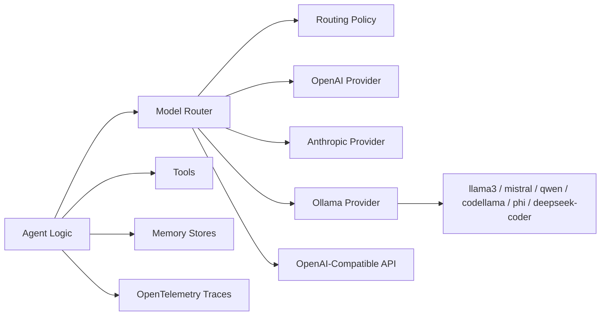
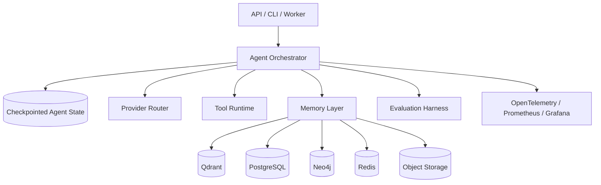

# Production Agent Engineering

A production-grade system design repository for agentic AI architectures across cloud and local-first inference.

This repository is organized like an engineering handbook plus runnable reference implementations. It focuses on how real agent systems are designed, deployed, observed, evaluated, and scaled.

## What This Repository Covers

- Agentic design patterns with theory, diagrams, tradeoffs, and failure modes
- Runnable Python projects for each pattern
- Shared provider abstraction for OpenAI, Anthropic, Ollama, OpenAI-compatible APIs, and local GGUF-backed serving
- Storage and memory architectures for vector, SQL, graph, cache, event-sourced, and hybrid systems
- Orchestration patterns using explicit workflow state, eventing, graphs, and human approvals
- Production concerns: observability, security, governance, retries, cost, latency, context engineering, and auditability
- Evaluation and benchmarking harnesses for latency, retrieval quality, hallucination risk, tool reliability, and local model performance

## Quick Start

```bash
python -m venv .venv
source .venv/bin/activate
pip install -e .
cp .env.example .env
python projects/react-agent-ai-research-assistant/src/main.py "Research local-first agent architectures"
```

Local-first with Ollama:

```bash
ollama pull llama3
ollama pull mistral
ollama serve
MODEL_PROVIDER=ollama OLLAMA_MODEL=llama3 python projects/rag-agent-enterprise-document-chatbot/src/main.py "Summarize the policy corpus"
```

Cloud mode:

```bash
MODEL_PROVIDER=openai OPENAI_MODEL=gpt-4o-mini OPENAI_API_KEY=... python projects/planner-executor-travel-planning-agent/src/main.py "Plan 5 days in Tokyo"
```

## Repository Map

```text
patterns/            Pattern theory, architecture, diagrams, tradeoffs, failure modes
projects/            Runnable implementations mapped to every pattern
shared/              Provider abstraction, telemetry, tools, memory, evaluation helpers
storage-patterns/    Vector, SQL, graph, cache, event sourcing, object storage, semantic cache
orchestration/       Workflow, event-driven, graph, checkpointing, and HITL design notes
benchmarks/          Benchmark harnesses and experiment templates
comparisons/         Pattern, provider, storage, framework, and model comparison matrices
diagrams/            Global Mermaid architecture diagrams
docs/                Production engineering guides
papers/              Reading lists and annotated paper notes
datasets/            Dataset manifests and small sample data
notebooks/           Experiment notebooks
```

## Design Patterns

| Pattern | Runnable Project | Best For |
| --- | --- | --- |
| ReAct Agent | AI Research Assistant | Tool use, search, stepwise reasoning |
| Planner-Executor | Travel Planning Agent | Complex tasks with decomposable subtasks |
| Reflection / Self-Critique | Self-Correcting Coding Agent | Quality improvement and verification loops |
| Tree of Thoughts | Strategy Game Agent | Branching search and strategic reasoning |
| RAG Agent | Enterprise Document Chatbot | Grounded answers over private knowledge |
| Memory-Centric Agent | Persistent Personal Assistant | Personalized durable context |
| Multi-Agent Collaboration | Startup Company Simulation | Specialist collaboration |
| Hierarchical Agents | Autonomous Software Company | Delegation and management layers |
| Debate Agents | AI Debate Arena | Adversarial evaluation and robust conclusions |
| Graph-Based Orchestration | Enterprise Workflow Engine | Typed state machines and workflow control |
| Event-Driven Agents | Slack Incident Response Bot | Async events, alerts, incidents |
| Human-in-the-Loop | Legal Contract Review Agent | Approval gates and high-risk workflows |
| Autonomous Goal-Seeking Agents | Autonomous Research Agent | Long-running goal pursuit |
| Blackboard Architecture | Collaborative Problem Solving System | Shared problem state across specialists |

## Provider Abstraction



Agents depend on `shared.llm.base_provider.LLMProvider`, not vendor SDKs. This keeps provider swapping, fallback routing, local/offline execution, and test doubles isolated from agent logic.

## Ollama Setup

```bash
brew install ollama
ollama serve
ollama pull llama3
ollama pull mistral
ollama pull qwen
ollama pull codellama
ollama pull phi
ollama pull deepseek-coder
```

See [docs/ollama-local-models.md](docs/ollama-local-models.md) for CPU-only operation, GPU acceleration, Docker, quantization, llama.cpp, vLLM, batching, and performance tuning.

## Global Architecture



## Benchmarks

```bash
python benchmarks/run_latency.py --provider ollama --model llama3
python benchmarks/run_retrieval_quality.py --dataset datasets/sample_corpus.jsonl
python projects/tree-of-thoughts-strategy-game-agent/benchmarks/benchmark.py
```

Benchmark dimensions include latency, tokens, cost, retrieval quality, tool success rate, orchestration overhead, hallucination risk, and quantized local model throughput.

## Roadmap

- Add complete FastAPI services for selected reference projects
- Add LangGraph, CrewAI, and AutoGen variants for comparable workflows
- Add Qdrant/PostgreSQL/Redis/Neo4j docker profiles
- Add golden task suites and regression evaluation dashboards
- Add local model benchmark reports for llama3, mistral, qwen, codellama, phi, and deepseek-coder
- Add production deployment guides for Kubernetes and GPU-backed local inference

## Contributing

Contributions should improve engineering depth: runnable code, better failure analysis, measurement, operational guidance, diagrams, or realistic production tradeoffs.
