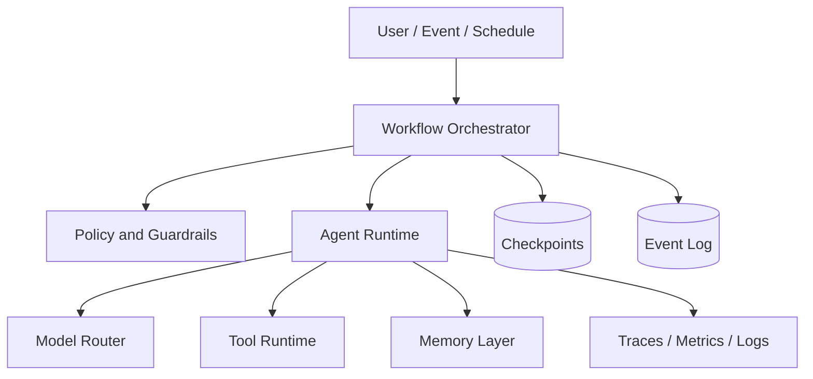

# Architecture Overview

Production agent systems are distributed systems with probabilistic components. The core design question is not only how to prompt a model, but how to coordinate state, tools, memory, failure handling, observability, and governance around model calls.

Key production boundaries:

- The orchestrator owns workflow state and retries.
- Agents own task reasoning and tool selection.
- Tools own deterministic external side effects.
- Memory systems own durable context and retrieval.
- Provider adapters own vendor-specific LLM behavior.
