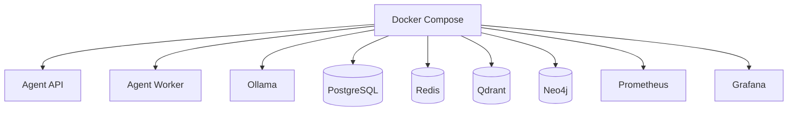

# Docker Architecture

```mermaid
flowchart TB
    Compose[Docker Compose] --> AgentAPI[Agent API]
    Compose --> Worker[Agent Worker]
    Compose --> Ollama[Ollama]
    Compose --> Postgres[(PostgreSQL)]
    Compose --> Redis[(Redis)]
    Compose --> Qdrant[(Qdrant)]
    Compose --> Neo4j[(Neo4j)]
    Compose --> Prometheus[Prometheus]
    Compose --> Grafana[Grafana]
```

Use compose profiles to run only what a project needs. Local-first projects can run entirely without cloud credentials when `MODEL_PROVIDER=ollama` or `MODEL_PROVIDER=mock`.
