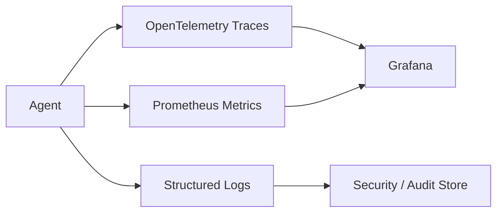

# Observability

Observe model calls, tool calls, workflow transitions, retrieval, memory writes, and human approvals.

Recommended telemetry:

- Latency by provider, model, tool, and workflow node
- Token usage and estimated cost
- Retrieval hit rate and citation coverage
- Tool error rates and retry counts
- Human approval queue age
- Hallucination and groundedness evaluation scores
