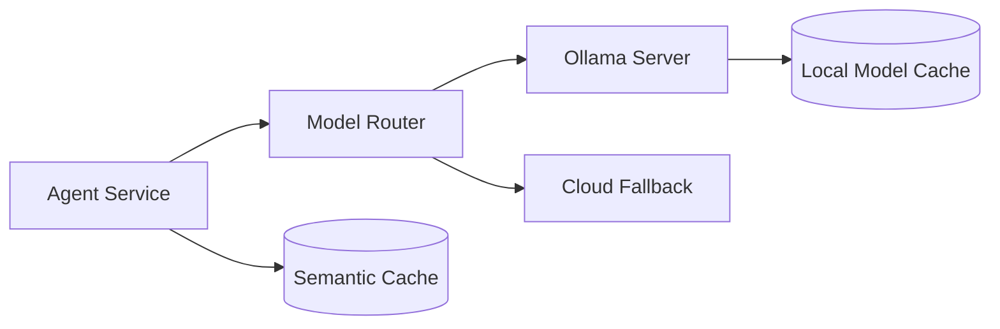

# Ollama and Local Model Setup

Ollama is the primary local inference path in this repository.

```bash
brew install ollama
ollama serve
ollama pull llama3
ollama pull mistral
ollama pull deepseek-coder
ollama pull qwen
ollama pull codellama
ollama pull phi
```

CPU-only mode works for small and quantized models, but latency rises quickly with context size. Use smaller quantizations, reduce max output tokens, and prefer retrieval over long prompt stuffing.

GPU acceleration depends on platform support. On Linux with NVIDIA GPUs, run Ollama with the NVIDIA container runtime or native drivers. For higher throughput serving, compare Ollama with vLLM for batching and llama.cpp for GGUF portability.

Local deployment pattern:



Optimization checklist:

- Keep prompts compact and structured.
- Use quantized models for memory-constrained devices.
- Batch independent requests when throughput matters.
- Cache embeddings and deterministic tool results.
- Benchmark per task, not only generic tokens per second.
