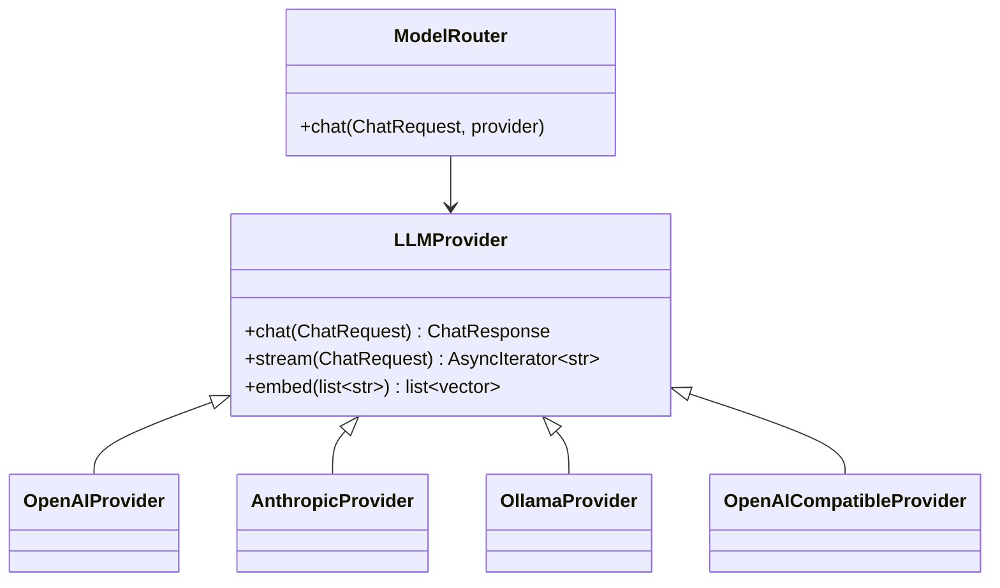

# Provider Abstraction

Agent logic calls `ModelRouter.chat()` and never imports vendor SDKs directly. Providers implement a common contract for chat, streaming, embeddings, tool calling, structured outputs, retries, and rate limits.

Design goals:

- Swap providers without changing agents.
- Prefer local-first operation with cloud fallback.
- Support offline demos through the mock provider.
- Centralize retries, timeouts, rate limits, and structured output handling.
