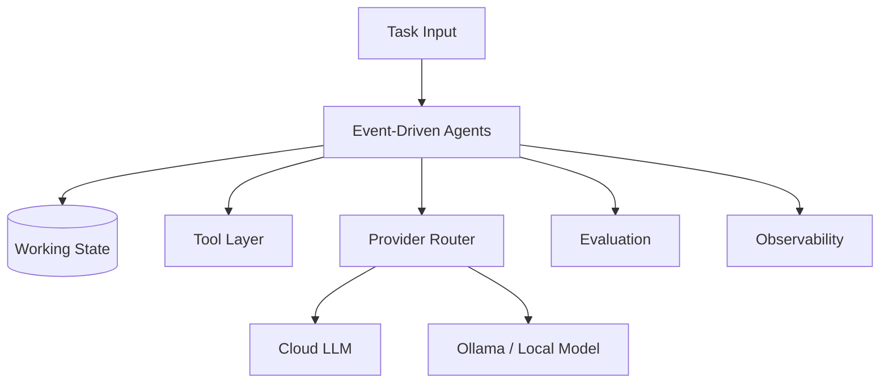

# Event-Driven Agents

React to events through queues, handlers, and durable state.

## Production Use Cases

- Build workflows where reasoning must be explicit and inspectable.
- Separate probabilistic decisions from deterministic tools.
- Capture intermediate state for replay, evaluation, and debugging.

## Architecture

## Runnable Project

See `projects/event-driven-agents-slack-incident-response-bot`.

## Engineering Checklist

- Define state schema before prompts.
- Make every tool call typed, observable, and retry-aware.
- Add evaluation tasks for expected behavior and known failure modes.
- Provide local/offline mode through Ollama or mock provider.
