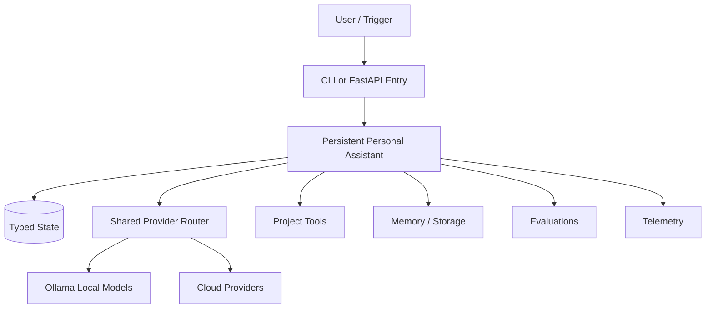

# Persistent Personal Assistant

Pattern: **Memory-Centric Agent**

Use durable short-term, episodic, and semantic memory.

## Architecture



## Run

```bash
cp .env.example .env
MODEL_PROVIDER=mock python src/main.py "Run the reference workflow"
MODEL_PROVIDER=ollama OLLAMA_MODEL=llama3 python src/main.py "Run locally"
MODEL_PROVIDER=openai OPENAI_MODEL=gpt-4o-mini python src/main.py "Run in cloud mode"
```

## Main Components

- `src/main.py`: CLI entry point using the shared provider abstraction.
- `src/agent.py`: Agent state and extension points.
- `benchmarks/benchmark.py`: Latency and workflow benchmark placeholder.
- `evals/eval.py`: Golden task and behavior evaluation placeholder.
- `docs/production.md`: Scaling, failure, observability, and security notes.

## Production Concerns

- Checkpoint state between model/tool calls.
- Add idempotency keys for side-effecting tools.
- Trace provider calls, tool calls, memory reads, and memory writes.
- Budget tokens, latency, and cost per workflow.
- Prefer local Ollama mode for privacy-sensitive development and offline demos.

## Failure Modes

- Invalid tool arguments
- Stale or polluted memory
- Prompt injection through user or retrieved content
- Provider timeout or rate limit
- Non-idempotent retries

## Benchmarks

Track latency, token usage, tool success rate, retries, retrieval quality where applicable, and local model throughput.
