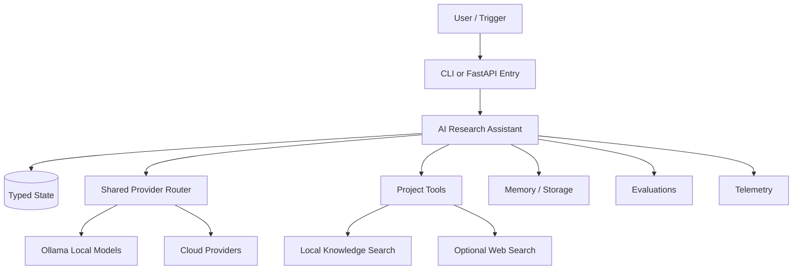

# AI Research Assistant

Pattern: **ReAct Agent**

Reasoning and acting loop with tools and explicit observations.

This project now runs a real ReAct-style loop:

1. Build research queries from the task.
2. Choose a tool.
3. Execute the tool.
4. Record observations and sources.
5. Ask the configured model to synthesize an answer from the trace.

By default it gives the agent both a local knowledge-base tool and a web search tool. The model chooses which tool to use for each research query. Use `WEB_SEARCH_MODE=off` or `--no-web` only when you need a fully offline run.

## Architecture



## Run

```bash
cp .env.example .env
MODEL_PROVIDER=mock python src/main.py "Run the reference workflow"
MODEL_PROVIDER=ollama OLLAMA_MODEL=llama3 python src/main.py "Run locally"
MODEL_PROVIDER=openai OPENAI_MODEL=gpt-4o-mini python src/main.py "Run in cloud mode"
```

From the repository root:

```bash
python projects/react-agent-ai-research-assistant/src/main.py "Research local-first agent architectures"
python projects/react-agent-ai-research-assistant/src/main.py "Research latest local-first agent architecture benchmarks"
```

Force offline/local-only mode:

```bash
WEB_SEARCH_MODE=off python projects/react-agent-ai-research-assistant/src/main.py "Research latest agent papers"
python projects/react-agent-ai-research-assistant/src/main.py --no-web "Research latest agent papers"
```

## Main Components

- `src/main.py`: CLI entry point using the shared provider abstraction.
- `src/agent.py`: ReAct loop, state, tool selection, and synthesis.
- `src/tools.py`: Local knowledge search and optional web search tools.
- `data/local_knowledge.jsonl`: Offline research corpus for local-first operation.
- `benchmarks/benchmark.py`: Latency and workflow benchmark placeholder.
- `evals/eval.py`: Golden task and behavior evaluation placeholder.
- `docs/production.md`: Scaling, failure, observability, and security notes.

## Production Concerns

- Checkpoint state between model/tool calls.
- Add idempotency keys for side-effecting tools.
- Trace provider calls, tool calls, memory reads, and memory writes.
- Budget tokens, latency, and cost per workflow.
- Prefer local Ollama mode for privacy-sensitive development and offline demos.

## Failure Modes

- Invalid tool arguments
- Stale or polluted memory
- Prompt injection through user or retrieved content
- Provider timeout or rate limit
- Non-idempotent retries

## Benchmarks

Track latency, token usage, tool success rate, retries, retrieval quality where applicable, and local model throughput.
