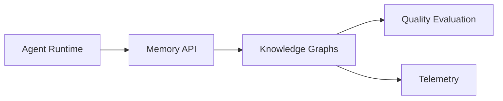

# Knowledge Graphs

Entity, relation, provenance, and multi-hop reasoning stores.

## Why Agents Need It

Agents need this storage layer to preserve context, coordinate workflows, support retrieval, and make behavior auditable across model calls.

## Architecture

## Tradeoffs

Consider latency, consistency, operational cost, data lifecycle, privacy, backup strategy, and query complexity.

## Production Scaling

Add indexes, quotas, retention policies, backups, schema migrations, monitoring, and load tests before production use.

## Implementation Example

See `examples/example.py`.
